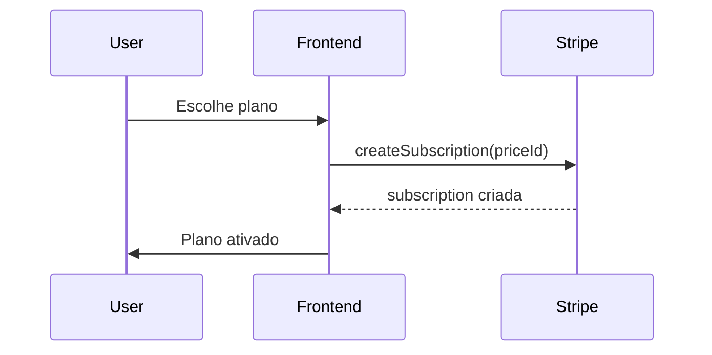
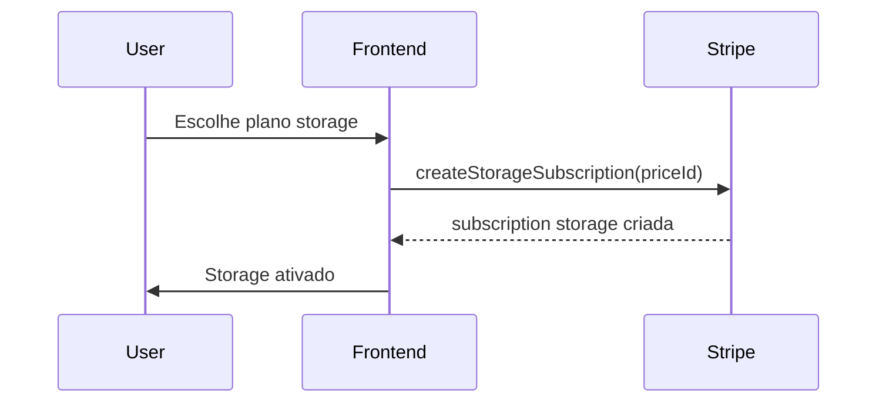
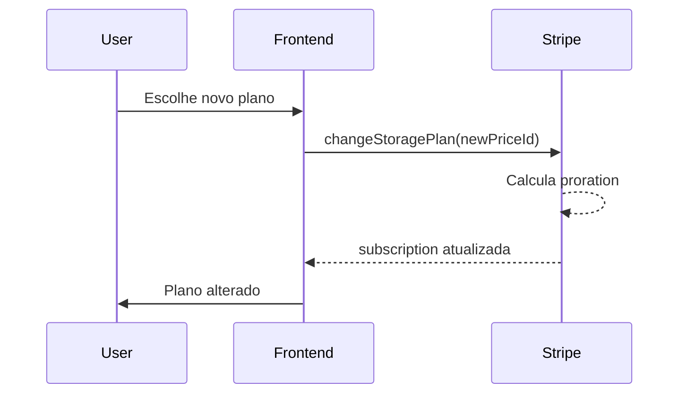
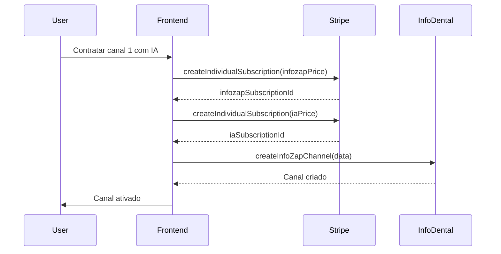
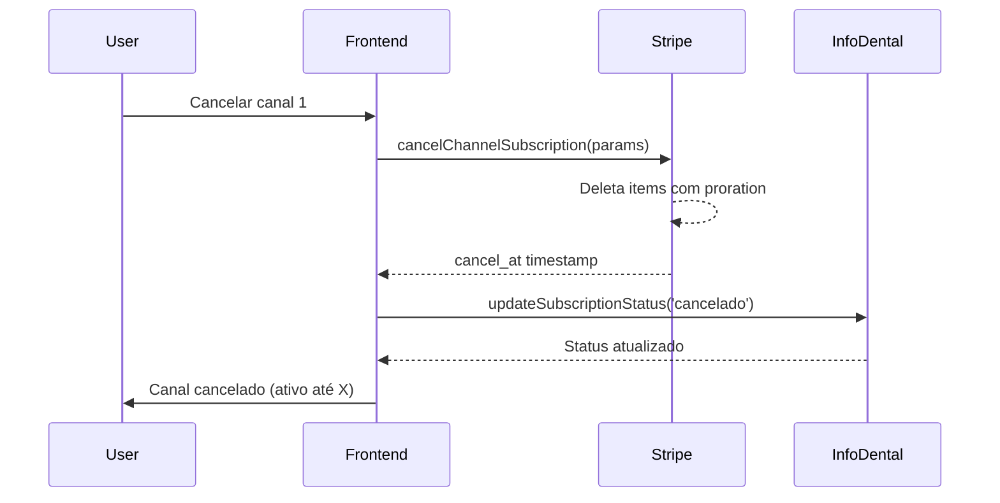
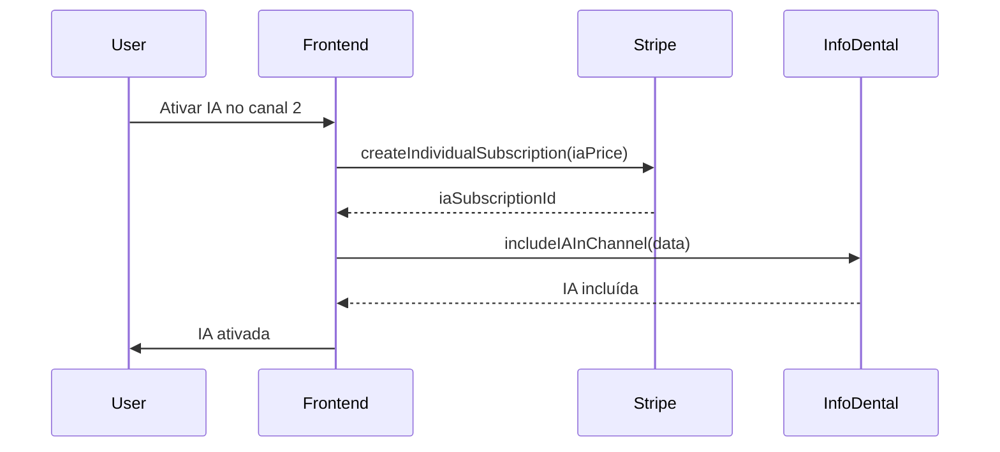
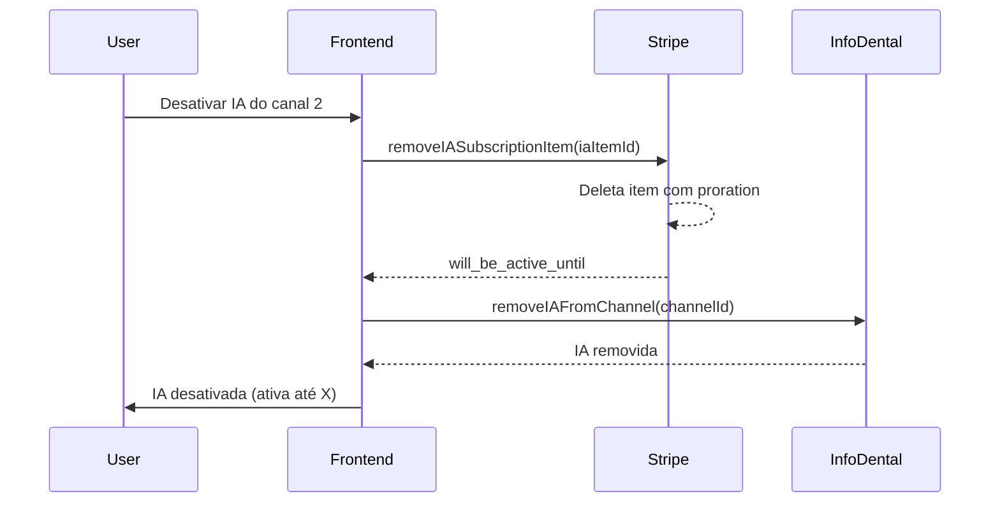
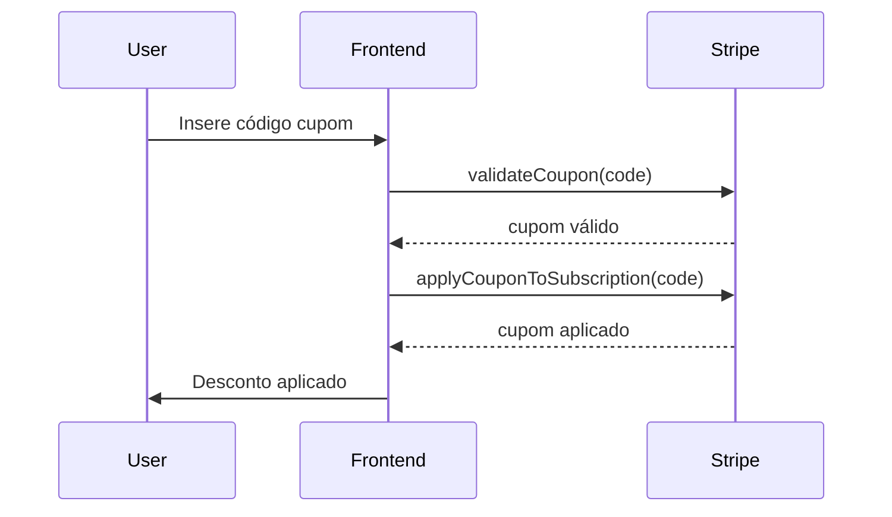
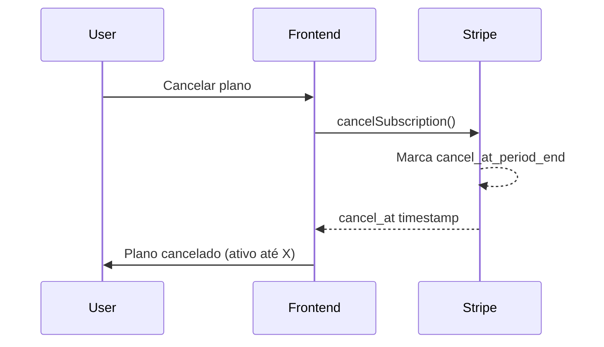

# Controle de Assinaturas - InfoDental

Este documento detalha toda a arquitetura e processos de controle de assinaturas do sistema InfoDental, incluindo todos os métodos, fluxos e integrações.

## 📋 Índice

1. [Visão Geral](#visão-geral)
2. [Arquitetura](#arquitetura)
3. [Produtos e Preços](#produtos-e-preços)
4. [Estratégias de Assinatura](#estratégias-de-assinatura)
5. [Módulos e Arquivos](#módulos-e-arquivos)
6. [API Stripe](#api-stripe)
7. [API InfoDental](#api-infodental)
8. [Hooks React](#hooks-react)
9. [Fluxos de Negócio](#fluxos-de-negócio)
10. [Métodos de Pagamento](#métodos-de-pagamento)

---

## 🎯 Visão Geral

O sistema de controle de assinaturas do InfoDental gerencia três tipos principais de produtos:

1. **Plano Principal** - Plano base do sistema InfoDental
2. **Storage (Armazenamento)** - Planos de armazenamento adicional
3. **InfoZap + IA** - Canais WhatsApp com suporte opcional de IA

### Tecnologias Utilizadas

- **Stripe**: Gateway de pagamento e gerenciamento de assinaturas
- **Next.js 15**: Framework React com App Router
- **TypeScript**: Linguagem de programação
- **Server Actions**: Para operações do lado do servidor
- **API InfoDental**: API proprietária para gerenciamento de canais WhatsApp

---

## 🏗️ Arquitetura

### Modelo de Subscriptions

O sistema utiliza **subscriptions separadas** para cada produto:

- **1 Subscription** → Plano Principal (obrigatória)
- **1 Subscription** → Storage (opcional, mensal)
- **1 Subscription** → InfoZap/IA (opcional, contém múltiplos items)

```
Customer (cus_xxx)
├── Subscription 1: Plano Principal
│   └── Item: price_xxx (prod_T9AmlVw7Z608Rm)
├── Subscription 2: Storage
│   └── Item: price_xxx (prod_T9AfZhzca9pgNW)
└── Subscription 3: InfoZap/IA
    ├── Item 1: Canal 1 InfoZap (price_xxx)
    ├── Item 2: Canal 1 IA (price_xxx)
    ├── Item 3: Canal 2 InfoZap (price_xxx)
    └── ...
```

### Vantagens desta Abordagem

- ✅ **Separação clara** entre produtos diferentes
- ✅ **Ciclos de cobrança independentes**
- ✅ **Flexibilidade** para adicionar/remover produtos
- ✅ **Proration automática** do Stripe
- ✅ **Recomendação oficial do Stripe**

---

## 💰 Produtos e Preços

### 1. Plano Principal

**Product ID**: `prod_T9AmlVw7Z608Rm`

| Plano | Price ID | Valor | Intervalo |
|-------|----------|-------|-----------|
| Plano Mensal | (configurado no Stripe) | R$ X/mês | Mensal |
| Plano Anual | (configurado no Stripe) | R$ X/ano | Anual |

### 2. Storage (Armazenamento)

**Product ID**: `prod_T9AfZhzca9pgNW`

| Plano | Price ID | Valor | Intervalo |
|-------|----------|-------|-----------|
| 5GB | (configurado no Stripe) | R$ X/mês | Mensal |
| 10GB | (configurado no Stripe) | R$ X/mês | Mensal |
| 20GB | (configurado no Stripe) | R$ X/mês | Mensal |
| 50GB | (configurado no Stripe) | R$ X/mês | Mensal |

**Observação**: Storage sempre tem cobrança mensal, independente do plano principal.

### 3. InfoZap (Canais WhatsApp)

**Product ID**: `prod_T9SqvByfpsLwI8`

| Canal | Price ID | Valor | Descrição |
|-------|----------|-------|-----------|
| Canal 0 | - | Gratuito | Canal IA standalone |
| Canal 1 | `price_1SECzfFU8GiWtc93h3ZHje9i` | R$ X/mês | Primeiro canal |
| Canal 2 | `price_1SECzWFU8GiWtc93KoJzqJvQ` | R$ X/mês | Segundo canal |
| Canal 3 | `price_1SECyjFU8GiWtc93YNXqE9Qm` | R$ X/mês | Terceiro canal |
| Canal 4 | `price_1SD9uaFU8GiWtc93T6iUCup3` | R$ X/mês | Quarto canal |

### 4. IA InfoZap

**Product ID**: `prod_TA8gkanW3rgytK`

| Canal | Price ID | Valor | Descrição |
|-------|----------|-------|-----------|
| Canal 0 | `price_1SED1wFU8GiWtc93OiluGKYr` | R$ X/mês | IA standalone |
| Canal 1 | `price_1SED1nFU8GiWtc934qG3BqOM` | R$ X/mês | IA do canal 1 |
| Canal 2 | `price_1SED1fFU8GiWtc93fg1q7D1s` | R$ X/mês | IA do canal 2 |
| Canal 3 | `price_1SED1XFU8GiWtc93TSAyazvz` | R$ X/mês | IA do canal 3 |
| Canal 4 | `price_1SDoOjFU8GiWtc93gKzuVhk6` | R$ X/mês | IA do canal 4 |

---

## 🔄 Estratégias de Assinatura

### Estratégia 1: Subscriptions Separadas (ATUAL - RECOMENDADA)

Cada produto tem sua própria subscription:

**Vantagens**:
- ✅ Gerenciamento independente
- ✅ Ciclos de cobrança diferentes
- ✅ Fácil adicionar/remover
- ✅ Proration automática

**Exemplo de Uso**:
```typescript
// Criar subscription de Storage
await createStorageSubscription(priceId);

// Criar subscription de InfoZap
await createInfoZapSubscription(priceId);

// Adicionar item à subscription InfoZap
await addItemToInfoZapSubscription({ priceId, metadata });
```

### Estratégia 2: Add-ons na Mesma Subscription (DEPRECATED)

Adiciona produtos como items na subscription principal usando Flexible Billing Mode.

**Desvantagens**:
- ❌ Complexidade com diferentes intervalos
- ❌ Requer migração para flexible billing
- ❌ Mais difícil de gerenciar

---

## 📁 Módulos e Arquivos

### Estrutura de Arquivos

```
src/
├── app/
│   ├── actions/
│   │   ├── stripe.ts          # Server Actions para Stripe
│   │   └── infodental.ts      # Server Actions para API InfoDental
│   ├── api/
│   │   └── stripe/
│   │       ├── setup-intent/route.ts      # Setup Intent para cartões
│   │       └── payment-methods/route.ts   # CRUD de métodos de pagamento
│   └── meuplano/
│       └── page.tsx           # Página principal de gerenciamento
├── lib/
│   ├── stripe.ts              # Cliente Stripe
│   ├── infozapAPI.ts          # Cliente API InfoDental
│   ├── useSubscriptions.ts    # Hooks de assinaturas
│   └── useInfoZapChannels.ts  # Hook de canais InfoZap
└── components/
    ├── ui/                    # Componentes UI reutilizáveis
    ├── AddCardForm.tsx        # Formulário adicionar cartão
    ├── Skeleton.tsx           # Loading skeleton
    └── LoadingSpinner.tsx     # Spinner de loading
```

---

## 🔌 API Stripe

### Cliente Stripe (`src/lib/stripe.ts`)

```typescript
import Stripe from 'stripe';

export const stripe = new Stripe(process.env.STRIPE_SECRET_KEY, {
  apiVersion: '2025-08-27.basil',
  typescript: true,
});
```

### Server Actions Principais (`src/app/actions/stripe.ts`)

#### 1. Gerenciamento de Customer

##### `getCustomerData()`
Busca dados completos do customer incluindo subscription, métodos de pagamento e plano atual.

**Retorna**:
```typescript
{
  customer: {
    id, email, name, phone, address, metadata
  },
  subscription: { ... },
  paymentMethods: [ ... ]
}
```

##### `updateCustomerData(data)`
Atualiza dados do customer.

**Parâmetros**:
```typescript
{
  name?: string,
  email?: string,
  phone?: string,
  metadata?: any
}
```

---

#### 2. Subscriptions - Listagem e Consulta

##### `getAllCustomerSubscriptions()`
Lista TODAS as subscriptions ativas do customer (plano, storage, infozap).

**Retorna**:
```typescript
{
  subscriptions: Array<{
    id: string,
    status: string,
    current_period_end: number,
    current_period_start: number,
    cancel_at_period_end: boolean,
    items: Array<{...}>
  }>
}
```

##### `getProductPrices(productId)`
Busca todos os preços disponíveis de um produto.

**Retorna**:
```typescript
{
  product: { id, name, description, metadata },
  prices: Array<{
    id, nickname, unit_amount, currency, recurring, metadata
  }>
}
```

##### `getCurrentPlan()`
Busca o plano principal ativo do customer com todos os detalhes.

**Retorna**:
```typescript
{
  product: { ... },
  prices: [ ... ],
  subscription: {
    id,
    status,
    current_period_end,
    current_period_start,
    cancel_at_period_end,
    discount: { ... },
    items: [ ... ]
  }
}
```

##### `getUpcomingInvoice()`
Busca a próxima fatura (upcoming invoice) com detalhes de todos os items.

**Retorna**:
```typescript
{
  id, amount_due, amount_paid, amount_remaining,
  subtotal, total, tax, total_discount_amounts,
  period_start, period_end,
  lines: Array<{
    id, description, productName, amount, quantity, unit_amount, period
  }>,
  discounts: [ ... ]
}
```

##### `getInvoices()`
Busca histórico de faturas do customer.

**Retorna**:
```typescript
{
  invoices: Array<{
    id, number, amount_due, amount_paid, status, created,
    hosted_invoice_url, invoice_pdf,
    lines: [ ... ]
  }>
}
```

---

#### 3. Plano Principal

##### `hasActivePlan()`
Verifica se o customer tem um plano principal ativo.

**Retorna**: `boolean`

##### `createSubscription(priceId)`
Cria uma nova subscription do plano principal.

**Parâmetros**:
- `priceId`: ID do preço escolhido

**Observações**:
- Cobra imediatamente (`payment_behavior: 'error_if_incomplete'`)
- Requer método de pagamento padrão configurado
- Erro se já existe subscription do plano principal

##### `updateSubscription(newPriceId)`
Atualiza o preço da subscription do plano principal (trocar plano).

**Parâmetros**:
- `newPriceId`: ID do novo preço

**Observações**:
- Usa `proration_behavior: 'create_prorations'`
- Gera fatura proporcional automaticamente

##### `cancelSubscription()`
Cancela a subscription do plano principal no final do período.

**Retorna**:
```typescript
{
  success: true,
  cancel_at: number  // Timestamp Unix
}
```

##### `reactivateSubscription()`
Remove o agendamento de cancelamento da subscription.

**Retorna**:
```typescript
{
  success: true,
  subscription_id: string
}
```

---

#### 4. Storage (Armazenamento)

##### `getStorageProduct()`
Busca produto de storage com todos os preços disponíveis.

##### `getCurrentStorage()`
Busca a subscription de storage atual do customer.

**Retorna**:
```typescript
{
  hasStorage: boolean,
  subscription: {
    id, status, current_period_end, cancel_at_period_end,
    items: [ ... ]
  } | null
}
```

##### `createStorageSubscription(priceId)`
Cria uma nova subscription separada de storage.

**Parâmetros**:
- `priceId`: ID do preço do storage

**Validações**:
- ✅ Verifica se tem plano principal ativo
- ✅ Cancela subscriptions incompletas antes
- ✅ Verifica se já existe subscription de storage
- ✅ Cobra imediatamente

**Retorna**:
```typescript
{
  success: true,
  subscriptionId: string,
  current_period_end: number
}
```

##### `changeStoragePlan(newPriceId)`
Altera o plano de armazenamento existente.

**Parâmetros**:
- `newPriceId`: ID do novo preço

**Observações**:
- Usa proration automática
- Gera crédito/débito proporcional

##### `addOrChangeStoragePlan(priceId)`
**MÉTODO INTELIGENTE**: Adiciona storage se não existe, ou altera se já existe.

**Parâmetros**:
- `priceId`: ID do preço

**Lógica**:
```typescript
if (existingStorage) {
  await changeStoragePlan(priceId);
} else {
  await createStorageSubscription(priceId);
}
```

##### `cancelSpecificSubscription(subscriptionId)`
Cancela uma subscription específica no final do período.

**Retorna**:
```typescript
{
  success: true,
  cancel_at: number
}
```

##### `reactivateSpecificSubscription(subscriptionId)`
Reativa uma subscription cancelada.

---

#### 5. InfoZap e IA

##### `getInfoZapSubscription()`
Busca a subscription de InfoZap/IA com todos os canais.

**Retorna**:
```typescript
{
  hasSubscription: boolean,
  subscription: {
    id, status, current_period_end, cancel_at_period_end,
    items: Array<{
      id, price, quantity
    }>
  } | null
}
```

##### `getIASubscription()`
Busca a subscription de IA (similar ao InfoZap).

##### `addItemToInfoZapSubscription(params)`
Adiciona um novo item (canal) à subscription InfoZap/IA.

**Parâmetros**:
```typescript
{
  priceId: string,
  metadata?: {
    channel_id: string,
    type: 'infozap' | 'ia'
  }
}
```

**Lógica**:
- Se não existe subscription → cria nova com primeiro item
- Se existe subscription → adiciona item à subscription existente
- Usa proration para cobrar proporcional

**Retorna**:
```typescript
{
  success: true,
  subscriptionId: string,  // Subscription Item ID (si_xxx)
  current_period_end: number
}
```

##### `removeIASubscriptionItem(iaSubscriptionItemId)`
Remove apenas a IA de um canal.

**Parâmetros**:
- `iaSubscriptionItemId`: ID do subscription item da IA

**Lógica**:
- Deleta o item com proration (gera crédito)
- Se for o último item da subscription → cancela a subscription inteira
- IA permanece ativa até o fim do período

**Retorna**:
```typescript
{
  success: true,
  will_be_active_until: number  // Timestamp Unix
}
```

##### `cancelChannelSubscription(params)`
Cancela um canal completo (InfoZap + IA).

**Parâmetros**:
```typescript
{
  infozapSubscriptionItemId: string,
  iaSubscriptionItemId?: string
}
```

**Lógica**:
- Deleta os subscription items com proration
- Se forem os últimos items → cancela subscription inteira
- Canal permanece ativo até o fim do período

**Retorna**:
```typescript
{
  success: true,
  cancel_at: number  // Timestamp Unix
}
```

##### `checkSubscriptionStatus(subscriptionId)`
Verifica o status de uma subscription específica.

**Parâmetros**:
- `subscriptionId`: Pode ser Subscription ID (`sub_xxx`) ou Subscription Item ID (`si_xxx`)

**Retorna**:
```typescript
{
  exists: boolean,
  active: boolean,
  status: string,
  cancel_at_period_end: boolean,
  current_period_end: number | null,
  cancel_at: number | null
}
```

##### `addInfoZapChannel(priceId)`
**DEPRECATED**: Adiciona 1 quantidade à subscription InfoZap (modelo antigo de quantity).

##### `removeInfoZapChannel()`
**DEPRECATED**: Remove 1 quantidade da subscription InfoZap.

##### `addIAChannel(priceId)`
**DEPRECATED**: Adiciona 1 quantidade à subscription IA.

##### `removeIAChannel()`
**DEPRECATED**: Remove 1 quantidade da subscription IA.

---

#### 6. Cupons e Descontos

##### `validateCoupon(code)`
Valida um cupom de desconto.

**Parâmetros**:
- `code`: Código do cupom

**Retorna**:
```typescript
{
  success: boolean,
  coupon: {
    id, name, percent_off, amount_off, currency, valid
  }
}
```

##### `applyCouponToSubscription(couponCode)`
Aplica cupom à subscription do plano principal.

**Parâmetros**:
- `couponCode`: Código do cupom

**Observações**:
- Valida cupom antes de aplicar
- Aplica apenas na subscription do plano principal
- Desconto não se aplica a storage ou infozap

##### `removeCouponFromSubscription()`
Remove cupom da subscription do plano principal.

---

#### 7. Métodos de Pagamento

##### `setDefaultPaymentMethod(paymentMethodId)`
Define um método de pagamento como padrão.

**Parâmetros**:
- `paymentMethodId`: ID do payment method

##### `removePaymentMethod(paymentMethodId)`
Remove (detach) um método de pagamento do customer.

##### `addPaymentMethod(paymentMethodId)`
Anexa um método de pagamento ao customer.

---

#### 8. Funções Auxiliares

##### `migrateToFlexibleBilling(subscriptionId)`
Migra uma subscription para flexible billing mode (permite items com diferentes intervalos).

**Uso**: Necessário para adicionar storage mensal em plano anual (estratégia deprecated).

##### `cancelIncompleteSubscriptions()`
Cancela todas as subscriptions incompletas do customer.

**Retorna**:
```typescript
{
  success: true,
  canceledCount: number
}
```

##### `cancelAllSubscriptions()`
Cancela TODAS as subscriptions do customer (plano + storage + infozap).

**Retorna**:
```typescript
{
  success: true,
  canceledCount: number
}
```

##### `updateSubscriptionPrice(subscriptionId, newPriceId)`
Atualiza o preço de uma subscription (genérico, usado internamente).

---

## 🌐 API InfoDental

### Cliente API (`src/lib/infozapAPI.ts`)

**Base URL**: `https://infoai.infodental.dental/manager.php`

**Autenticação**: Token via corpo da requisição

```typescript
const MANAGER_URL = 'https://infoai.infodental.dental/manager.php';
const API_TOKEN = process.env.NEXT_PUBLIC_INFOZAP_TOKEN;
```

### Funções Disponíveis

#### `createInfoZap(params)`
Cria uma nova instância InfoZap.

**Parâmetros**:
```typescript
{
  instance: string,
  id: number,
  titulo: string,
  infozap_stripe_si: string,
  infozap_stripe_price: string,
  infozap_stripe_expiration: string,
  assinatura_status: 'acontratar' | 'contratado' | 'cancelado',
  ia_stripe_si?: string,
  ia_stripe_price?: string,
  ia_stripe_expiration?: string
}
```

#### `removeInfoZap(params)`
Remove uma instância InfoZap.

**Parâmetros**:
```typescript
{
  instance: string,
  id_infozap: number
}
```

#### `reactivateInfoZap(params)`
Reativa uma instância InfoZap.

**Parâmetros**:
```typescript
{
  instance: string,
  id_infozap: number,
  infozap_stripe_si: string
}
```

---

### Server Actions InfoDental (`src/app/actions/infodental.ts`)

#### Interface de Canal

```typescript
interface InfoZapChannel {
  id: number,
  data: string,
  titulo: string,
  ia_ativa: 0 | 1,
  ia_stripe_si: string,
  ia_stripe_price: string,
  ia_stripe_expiration: string,
  infozap_stripe_si: string,
  infozap_stripe_price: string,
  infozap_stripe_expiration: string,
  assinatura_status?: 'acontratar' | 'contratado' | 'cancelado'
}
```

#### Métodos Disponíveis

##### `listInfoZapChannels()`
Lista todos os canais InfoZap da instância.

**Retorna**:
```typescript
{
  success: boolean,
  channels: InfoZapChannel[]
}
```

##### `createInfoZapChannel(params)`
Cria ou atualiza um canal InfoZap.

**Parâmetros**:
```typescript
{
  id: string,
  titulo?: string,
  ia_stripe_si?: string,
  ia_stripe_price?: string,
  ia_stripe_expiration?: string,
  infozap_stripe_si?: string,
  infozap_stripe_price?: string,
  infozap_stripe_expiration?: string,
  assinatura_status?: 'acontratar' | 'contratado' | 'cancelado'
}
```

**Método API**: `criar`

##### `removeInfoZapChannel(id_infozap)`
Remove um canal InfoZap.

**Método API**: `remover`

##### `reactivateInfoZapChannel(params)`
Reativa um canal InfoZap cancelado.

**Parâmetros**:
```typescript
{
  id_infozap: number,
  infozap_stripe_si: string
}
```

**Método API**: `reativar`

##### `includeIAInChannel(params)`
Inclui IA em um canal InfoZap existente.

**Parâmetros**:
```typescript
{
  id_infozap: number,
  ia_stripe_si: string,
  ia_stripe_price: string,
  ia_stripe_expiration: string
}
```

**Método API**: `incluir_ia`

##### `removeIAFromChannel(id_infozap)`
Remove IA de um canal InfoZap.

**Método API**: `remover_ia`

##### `updateChannelTitle(id_infozap, titulo)`
Altera o título de um canal.

**Método API**: `alterar_titulo`

##### `updateSubscriptionStatus(id_infozap, assinatura_status)`
Altera o status da assinatura de um canal.

**Parâmetros**:
- `assinatura_status`: `'acontratar' | 'contratado' | 'cancelado'`

**Método API**: `alterar_assinatura_status`

---

## ⚛️ Hooks React

### 1. `useAllSubscriptions()` (`src/lib/useSubscriptions.ts`)

Lista todas as subscriptions do customer.

**Retorna**:
```typescript
{
  subscriptions: Subscription[],
  loading: boolean,
  error: Error | null,
  reload: () => Promise<void>
}
```

**Uso**:
```typescript
const { subscriptions, loading, reload } = useAllSubscriptions();
```

---

### 2. `useProductPrices(productId)` (`src/lib/useSubscriptions.ts`)

Busca preços de um produto específico.

**Retorna**:
```typescript
{
  prices: Price[],
  product: any,
  loading: boolean,
  error: Error | null
}
```

**Uso**:
```typescript
const { prices, product, loading } = useProductPrices('prod_T9AmlVw7Z608Rm');
```

---

### 3. `useSubscriptionActions()` (`src/lib/useSubscriptions.ts`)

Hook com ações de gerenciamento de subscriptions.

**Retorna**:
```typescript
{
  addStorage: (priceId: string) => Promise<boolean>,
  addInfoZap: (priceId: string) => Promise<boolean>,
  cancel: (subscriptionId: string) => Promise<boolean>,
  cancelAll: () => Promise<boolean>,
  reactivate: (subscriptionId: string) => Promise<boolean>,
  updatePrice: (subscriptionId: string, newPriceId: string) => Promise<boolean>,
  loading: boolean,
  error: Error | null
}
```

**Uso**:
```typescript
const { addStorage, cancel, loading } = useSubscriptionActions();

await addStorage('price_xxx');
await cancel('sub_xxx');
```

---

### 4. `useSubscriptionManager()` (`src/lib/useSubscriptions.ts`)

Hook combinado com helpers para facilitar uso.

**Retorna**:
```typescript
{
  subscriptions: Subscription[],
  loading: boolean,
  error: Error | null,
  reload: () => Promise<void>,
  actions: { ... },
  // Helpers
  getSubscriptionByProduct: (productId: string) => Subscription | undefined,
  hasProduct: (productId: string) => boolean,
  getPlanName: (sub: Subscription) => string,
  getPlanPrice: (sub: Subscription) => number,
  getNextBilling: (sub: Subscription) => Date
}
```

**Uso**:
```typescript
const {
  subscriptions,
  hasProduct,
  getPlanName,
  actions
} = useSubscriptionManager();

if (hasProduct('prod_T9AfZhzca9pgNW')) {
  console.log('Tem storage');
}
```

---

### 5. `useStorageManager()` (`src/lib/useSubscriptions.ts`)

Hook específico para gerenciar storage.

**Retorna**:
```typescript
{
  storageSub: Subscription | undefined,
  hasStorage: boolean,
  prices: Price[],
  loading: boolean,
  add: (priceId: string) => Promise<boolean>,
  change: (newPriceId: string) => Promise<boolean>,
  addOrChange: (priceId: string) => Promise<boolean>,
  remove: () => Promise<boolean>
}
```

**Uso**:
```typescript
const { hasStorage, addOrChange, remove, prices } = useStorageManager();

// Adicionar ou alterar storage
await addOrChange('price_xxx');

// Remover storage
await remove();
```

---

### 6. `useInfoZapManager()` (`src/lib/useSubscriptions.ts`)

Hook específico para gerenciar InfoZap.

**Retorna**:
```typescript
{
  infozapSub: Subscription | undefined,
  hasInfoZap: boolean,
  prices: Price[],
  loading: boolean,
  add: (priceId: string) => Promise<boolean>,
  change: (newPriceId: string) => Promise<boolean>,
  remove: () => Promise<boolean>
}
```

---

### 7. `useInfoZapChannels()` (`src/lib/useInfoZapChannels.ts`)

Hook principal para gerenciar canais InfoZap com integração completa Stripe + API InfoDental.

**Retorna**:
```typescript
{
  channels: InfoZapChannelWithStatus[],
  loading: boolean,
  error: Error | null,
  reload: () => Promise<void>,
  addChannel: (params: {
    channelId: number,
    titulo?: string,
    withIA: boolean
  }) => Promise<boolean>,
  removeChannel: (channelId: number, hasIA: boolean) => Promise<{
    success: boolean,
    cancel_at?: number
  }>,
  reactivateChannel: (params: {
    channelId: number,
    withIA: boolean
  }) => Promise<boolean>,
  toggleIA: (channelId: number, currentIAStatus: boolean) => Promise<{
    success: boolean,
    will_be_active_until?: number
  }>
}
```

**Interface**:
```typescript
interface InfoZapChannelWithStatus {
  id: number,
  data: string,
  titulo: string,
  ia_ativa: 0 | 1,
  ia_stripe_si: string,
  ia_stripe_price: string,
  ia_stripe_expiration: string,
  infozap_stripe_si: string,
  infozap_stripe_price: string,
  infozap_stripe_expiration: string,
  assinatura_status: 'acontratar' | 'contratado' | 'cancelado',
  status: 'active' | 'cancelled' | 'pending' | 'acontratar',
  infozap_active_in_stripe?: boolean,
  ia_active_in_stripe?: boolean,
  cancel_at_period_end?: boolean,
  cancel_at?: number
}
```

**Uso**:
```typescript
const { channels, addChannel, removeChannel, toggleIA } = useInfoZapChannels();

// Adicionar canal com IA
await addChannel({
  channelId: 1,
  titulo: 'Suporte',
  withIA: true
});

// Cancelar canal
await removeChannel(1, true);

// Toggle IA
await toggleIA(1, channel.ia_ativa === 1);
```

---

## 🔄 Fluxos de Negócio

### 1. Contratar Plano Principal



**Código**:
```typescript
import { createSubscription } from '@/app/actions/stripe';

await createSubscription('price_xxx');
```

---

### 2. Adicionar Storage



**Código**:
```typescript
import { createStorageSubscription } from '@/app/actions/stripe';

await createStorageSubscription('price_xxx');
```

---

### 3. Alterar Plano de Storage



**Código**:
```typescript
import { changeStoragePlan } from '@/app/actions/stripe';

await changeStoragePlan('price_novo');
```

---

### 4. Contratar Canal InfoZap (com IA)



**Código**:
```typescript
import { useInfoZapChannels } from '@/lib/useInfoZapChannels';

const { addChannel } = useInfoZapChannels();

await addChannel({
  channelId: 1,
  titulo: 'Suporte',
  withIA: true
});
```

---

### 5. Cancelar Canal InfoZap



**Código**:
```typescript
const { removeChannel } = useInfoZapChannels();

const result = await removeChannel(1, true);
console.log('Ativo até:', new Date(result.cancel_at * 1000));
```

---

### 6. Adicionar IA em Canal Existente



**Código**:
```typescript
const { toggleIA } = useInfoZapChannels();

await toggleIA(2, false); // false = adicionar IA
```

---

### 7. Remover IA de Canal



**Código**:
```typescript
const { toggleIA } = useInfoZapChannels();

const result = await toggleIA(2, true); // true = remover IA
console.log('IA ativa até:', new Date(result.will_be_active_until * 1000));
```

---

### 8. Aplicar Cupom de Desconto



**Código**:
```typescript
import { applyCouponToSubscription } from '@/app/actions/stripe';

await applyCouponToSubscription('CUPOM10');
```

---

### 9. Cancelar Plano Principal



**Código**:
```typescript
import { cancelSubscription } from '@/app/actions/stripe';

const result = await cancelSubscription();
console.log('Ativo até:', new Date(result.cancel_at * 1000));
```

---

## 💳 Métodos de Pagamento

### API Routes

#### 1. Setup Intent - `POST /api/stripe/setup-intent`

Cria um Setup Intent para adicionar novo cartão.

**Response**:
```json
{
  "clientSecret": "seti_xxx_secret_xxx"
}
```

**Frontend**:
```typescript
const response = await fetch('/api/stripe/setup-intent', {
  method: 'POST'
});
const { clientSecret } = await response.json();
```

---

#### 2. Listar Payment Methods - `GET /api/stripe/payment-methods`

Lista todos os métodos de pagamento do customer.

**Response**:
```json
{
  "paymentMethods": [
    {
      "id": "pm_xxx",
      "type": "card",
      "card": {
        "brand": "visa",
        "last4": "4242",
        "exp_month": 12,
        "exp_year": 2025
      },
      "isDefault": true
    }
  ]
}
```

---

#### 3. Adicionar Payment Method - `POST /api/stripe/payment-methods`

Anexa um payment method ao customer e define como padrão.

**Body**:
```json
{
  "paymentMethodId": "pm_xxx"
}
```

**Ações**:
1. Anexa payment method ao customer
2. Define como padrão no customer
3. Atualiza todas as subscriptions ativas

---

#### 4. Definir como Padrão - `PUT /api/stripe/payment-methods`

Define um payment method existente como padrão.

**Body**:
```json
{
  "paymentMethodId": "pm_xxx"
}
```

---

#### 5. Remover Payment Method - `DELETE /api/stripe/payment-methods?id=pm_xxx`

Remove (detach) um payment method do customer.

**Query Params**:
- `id`: ID do payment method

---

### Fluxo de Adicionar Cartão

```typescript
// 1. Criar Setup Intent
const response = await fetch('/api/stripe/setup-intent', {
  method: 'POST'
});
const { clientSecret } = await response.json();

// 2. Confirmar com Stripe Elements
const { error, setupIntent } = await stripe.confirmCardSetup(clientSecret, {
  payment_method: {
    card: cardElement,
    billing_details: { ... }
  }
});

// 3. Anexar ao customer e definir como padrão
await fetch('/api/stripe/payment-methods', {
  method: 'POST',
  body: JSON.stringify({
    paymentMethodId: setupIntent.payment_method
  })
});
```

---

## 📊 Estados de Subscription

### Status Possíveis

| Status | Descrição | Ações Permitidas |
|--------|-----------|------------------|
| `active` | Subscription ativa | Cancelar, Atualizar plano |
| `trialing` | Em período de trial | Cancelar, Atualizar plano |
| `past_due` | Pagamento atrasado | Atualizar payment method |
| `unpaid` | Não pago | Atualizar payment method |
| `canceled` | Cancelada | Reativar (criar nova) |
| `incomplete` | Pagamento incompleto | Cancelar automaticamente |
| `incomplete_expired` | Expirada | Cancelar automaticamente |

### Cancel at Period End

Quando uma subscription é cancelada com `cancel_at_period_end: true`:
- Subscription permanece ativa até `current_period_end`
- Não haverá renovação automática
- Customer continua com acesso aos recursos
- Pode ser reativada antes do fim do período

---

## 🎨 Componentes UI

### AddCardForm (`src/components/AddCardForm.tsx`)

Formulário para adicionar novo cartão usando Stripe Elements.

**Props**: Nenhuma (usa context)

**Funcionalidades**:
- Integração com Stripe Elements
- Validação de cartão
- Feedback visual de sucesso/erro
- Fecha modal automaticamente

---

### Skeleton (`src/components/Skeleton.tsx`)

Componente de loading skeleton para melhor UX.

**Props**:
```typescript
{
  className?: string
}
```

---

### LoadingSpinner (`src/components/LoadingSpinner.tsx`)

Spinner de loading customizado.

---

## 🔒 Segurança e Boas Práticas

### Variáveis de Ambiente

```env
# Stripe
STRIPE_SECRET_KEY=sk_xxx
STRIPE_CUSTOMER_ID=cus_xxx
NEXT_PUBLIC_STRIPE_PUBLISHABLE_KEY=pk_xxx

# InfoDental
INFODENTAL_TOKEN=xxx
INFODENTAL_INSTANCE=xxx
NEXT_PUBLIC_INFOZAP_TOKEN=xxx
```

### Server Actions

✅ **Usar Server Actions** para operações sensíveis:
- Criação de subscriptions
- Aplicação de cupons
- Cancelamento de subscriptions
- Operações com API InfoDental

❌ **Nunca expor** secret keys no client-side

### Validações

Sempre validar:
1. ✅ Plano principal ativo antes de adicionar storage/canais
2. ✅ Método de pagamento configurado antes de criar subscription
3. ✅ Subscription não duplicada antes de criar nova
4. ✅ Permissions/ownership antes de modificar dados

---

## 📝 Exemplos de Uso Completos

### Exemplo 1: Fluxo Completo de Onboarding

```typescript
// 1. Adicionar método de pagamento
const setupResponse = await fetch('/api/stripe/setup-intent', {
  method: 'POST'
});
const { clientSecret } = await setupResponse.json();

const { setupIntent } = await stripe.confirmCardSetup(clientSecret, {
  payment_method: { card: cardElement }
});

await fetch('/api/stripe/payment-methods', {
  method: 'POST',
  body: JSON.stringify({
    paymentMethodId: setupIntent.payment_method
  })
});

// 2. Criar subscription do plano principal
await createSubscription('price_plano_mensal');

// 3. Adicionar storage
await createStorageSubscription('price_storage_10gb');

// 4. Adicionar canal InfoZap com IA
await addChannel({
  channelId: 1,
  titulo: 'Suporte',
  withIA: true
});
```

---

### Exemplo 2: Gerenciamento de Canais

```typescript
import { useInfoZapChannels } from '@/lib/useInfoZapChannels';

function ChannelManager() {
  const {
    channels,
    loading,
    addChannel,
    removeChannel,
    toggleIA
  } = useInfoZapChannels();

  // Contratar novo canal
  const handleAddChannel = async () => {
    const success = await addChannel({
      channelId: 2,
      titulo: 'Vendas',
      withIA: false
    });

    if (success) {
      alert('Canal adicionado com sucesso!');
    }
  };

  // Cancelar canal
  const handleCancelChannel = async (channelId: number, hasIA: boolean) => {
    const result = await removeChannel(channelId, hasIA);

    if (result.success) {
      const date = new Date(result.cancel_at! * 1000);
      alert(`Canal cancelado. Ativo até ${date.toLocaleString()}`);
    }
  };

  // Toggle IA
  const handleToggleIA = async (channel: InfoZapChannelWithStatus) => {
    const result = await toggleIA(channel.id, channel.ia_ativa === 1);

    if (result.success && result.will_be_active_until) {
      const date = new Date(result.will_be_active_until * 1000);
      alert(`IA desativada. Ativa até ${date.toLocaleString()}`);
    }
  };

  return (
    <div>
      {loading ? (
        <Skeleton />
      ) : (
        channels.map(channel => (
          <div key={channel.id}>
            <h3>{channel.titulo}</h3>
            <p>Status: {channel.status}</p>
            <p>IA: {channel.ia_ativa ? 'Ativa' : 'Inativa'}</p>

            {channel.status === 'active' && (
              <>
                <button onClick={() => handleCancelChannel(channel.id, channel.ia_ativa === 1)}>
                  Cancelar
                </button>
                <button onClick={() => handleToggleIA(channel)}>
                  {channel.ia_ativa ? 'Desativar IA' : 'Ativar IA'}
                </button>
              </>
            )}
          </div>
        ))
      )}
    </div>
  );
}
```

---

### Exemplo 3: Gerenciamento de Storage

```typescript
import { useStorageManager } from '@/lib/useSubscriptions';

function StorageManager() {
  const {
    hasStorage,
    storageSub,
    prices,
    loading,
    addOrChange,
    remove
  } = useStorageManager();

  const handleChangeStorage = async (priceId: string) => {
    const success = await addOrChange(priceId);

    if (success) {
      alert(hasStorage ? 'Plano alterado!' : 'Storage adicionado!');
    }
  };

  const handleRemoveStorage = async () => {
    const success = await remove();

    if (success) {
      alert('Storage cancelado!');
    }
  };

  return (
    <div>
      {hasStorage && (
        <div>
          <h3>Plano Atual</h3>
          <p>{storageSub?.items[0]?.price?.nickname}</p>
          <button onClick={handleRemoveStorage}>Cancelar</button>
        </div>
      )}

      <h3>Planos Disponíveis</h3>
      {prices.map(price => (
        <button
          key={price.id}
          onClick={() => handleChangeStorage(price.id)}
        >
          {price.nickname} - R$ {(price.unit_amount! / 100).toFixed(2)}
        </button>
      ))}
    </div>
  );
}
```

---

## 🐛 Debugging e Logs

### Logs do Stripe

Todos os métodos importantes incluem logs detalhados:

```typescript
console.log('🔍 [MÉTODO] Ação:', params);
console.log('✅ [MÉTODO] Sucesso:', result);
console.log('❌ [MÉTODO] Erro:', error);
```

### Verificar Status de Subscription

```typescript
const status = await checkSubscriptionStatus('sub_xxx');
console.log('Status:', status);
// {
//   exists: true,
//   active: true,
//   cancel_at_period_end: false,
//   current_period_end: 1234567890
// }
```

### Dashboard Stripe

Acessar: https://dashboard.stripe.com

- Subscriptions
- Customers
- Invoices
- Payment Methods
- Logs (última hora)

---

## 📖 Glossário

| Termo | Descrição |
|-------|-----------|
| **Subscription** | Assinatura recorrente no Stripe |
| **Subscription Item** | Item individual dentro de uma subscription |
| **Price** | Preço de um produto no Stripe |
| **Product** | Produto no Stripe (ex: InfoZap, Storage) |
| **Customer** | Cliente no Stripe |
| **Payment Method** | Método de pagamento (cartão, etc) |
| **Setup Intent** | Intent para configurar método de pagamento |
| **Proration** | Cálculo proporcional ao trocar/cancelar plano |
| **Invoice** | Fatura gerada pelo Stripe |
| **Coupon** | Cupom de desconto |
| **Metadata** | Dados customizados anexados a objetos Stripe |
| **Current Period End** | Data de fim do período atual de cobrança |
| **Cancel at Period End** | Cancelar no fim do período (não imediatamente) |

---

## 🎯 Próximos Passos e Melhorias

### Funcionalidades Planejadas

- [ ] Webhooks do Stripe para sincronização automática
- [ ] Dashboard de analytics de subscriptions
- [ ] Notificações de renovação/cancelamento
- [ ] Self-service para alteração de planos
- [ ] Histórico de alterações de subscription
- [ ] Suporte a múltiplas moedas
- [ ] Trial period para novos customers
- [ ] Programa de afiliados

### Otimizações

- [ ] Cache de subscriptions no client-side
- [ ] Prefetch de dados de subscriptions
- [ ] Lazy loading de componentes pesados
- [ ] Memoização de cálculos complexos
- [ ] Server-side rendering de páginas de planos

---

## 📞 Suporte

Para dúvidas ou problemas:

1. Verificar logs no console
2. Verificar Dashboard do Stripe
3. Consultar documentação do Stripe: https://stripe.com/docs
4. Abrir issue no repositório

---

**Última atualização**: 2025-10-05

**Versão do documento**: 1.0.0
